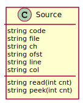

# 预备工作 - Source

在进行词法分析器的讲解之前，我们首先需要介绍辅助类 Source。

在读取字符串的过程中，我们需要统一换行符以及支持先行预测「Lookahead」，需要这些功能的原因后面会介绍。

Source 类的结构如下：

;

为了简化源文件的处理过程，我们将需要处理的源文件一次性整个地读取到属性 `code` 中，其余属性的含义分别为：

属性 | 作用
-----|-----
file | 源文件名
ch | 当前偏移量指代的字符
ofst | 当前的偏移量
line | 当前所在行号
col | 当前所在列号
isPeek | 用来标识当前是否处于 peek 模式

在 JS 中，可以通过下标来检索字符串中的字符。所以我们可以通过属性 `ofst` 作为下标来检索 `code` 中的字符，即 `this.code[this.ofst]` 的方式。

`ch` 表示我们当前读取到的字符。 

`ofst` 被设定为指向当前字符 `ch` 在 `code` 中的索引位置。

比如，对于字符串 `abcd` 而言，当 `ch` 为 `a` 时，`ofst` 的值为 `0`。为了读取下一个字符 `b`，我们需要先将 `ofst` 加 1，以加 1 后的值作为索引来检索字符，即：

```js
this.ofst += 1;
this.ch = this.code[this.ofst];
```

因此，`ofst` 的初始值被我们设定为 `-1`。

在不断的读入字符的过程中，我们还需要维护行列号，行列号主要用作生成调试信息。

Source 类目前只包含两个方法，分别是 `read` 和 `peak`。它们的作用都是读取给定数量的字符，组成字符串后返回给调用者。区别在于，`read` 方法会改变位置信息，包括 `ch`、`ofst`、`line`、`col`，而 `peek` 方法则不然。

我们使用 `peek` 方法来做先行预测，在出现可能分叉的地方进行使用。比如 Lua 中注释以 `--` 开头，我们可以直接向前 peek 两个字符，看看它们是否符合条件。

*为了使读者能够快速地运行文中的代码，所有代码都可以在 `node v11.5.0` 下直接运行而不需要借助 [Babel](https://babeljs.io/) 之类的编译器。当然读者还是需要在运行前注意一下代码中的 `require` 路径是否和自己的环境相匹配。*

下面给出 Source 的代码和注释：

```js
// 不同的操作系统可能使用不同的字符作为换行字符，常见的情况有
// \n, \r, \r\n 三种。
// \n 叫做「LF，Linefeed」存在于「*nix，Unix-like」系统中
// \r 叫做「Carriage Return」存在于老式的 MacOS 中
// \r\n 存在于 Windows 中
// 这里我们使用「NL，newline」作为换成的变量名，因为下面会将三种情况都统一成它。
const NL = "\n";
const CR = "\r";
const EOL = "\n";
// 0x03 在 ascii 表中的含义即为 end of text
const EOF = "\x03";

class Position {
  constructor(ofst, line, col) {
    this.ofst;
    this.line = line;
    this.col = col;
  }
}

class Source {
  // 我们的构造函数接收源文件代码，和源文件名
  // 源文件名用于生产调试信息
  constructor(code = "", file = "stdin") {
    this.code = code;
    this.file = file;
    this.ch = "";
    this.ofst = -1;
    this.line = 1;
    this.col = 0;
    this.isPeek = false;
  }

  read(cnt = 1) {
    const ret = [];
    let ofst = this.ofst;
    let c;
    while (cnt) {
      const next = ofst + 1;
      c = this.code[next];
      if (c === undefined) {
        c = EOF;
        ret.push(c);
        break;
      }
      ofst = next;
      // 这里我们将可能的三种换行都统一为 *nix 换行符 '\n'
      if (c === CR || c === NL) {
        if (c === CR && this.code[next + 1] === NL) ofst++;
        // 识别为换行之后，如果处于 read 模式，则需要更新行列号
        // 将行号加 1，表示进入了下一行
        // 将列号重置，表示此时处于新行的行首
        if (!this.isPeek) {
          this.line++;
          this.col = 0;
        }
        c = EOL;
      } else if (!this.isPeek) this.col++;
      ret.push(c);
      cnt--;
    }
    if (!this.isPeek) {
      this.ch = c;
      this.ofst = ofst;
    }
    return ret.join("");
  }

  // 由于 peek 逻辑除了不需要更新位置信息外、和 read 逻辑一致，因此我们通过
  // 设定 `isPeek` 属性使得在 read 内部得以区分当前状态
  peek(cnt = 1) {
    this.isPeek = true;
    const ret = this.read(cnt);
    this.isPeek = false;
    return ret;
  }

  getPos() {
    return new Position(this.ofst, this.line, this.col);
  }
}

module.exports = {
  NL,
  CR,
  EOL,
  EOF,
  Position,
  Source
};
```

对于类「Position」和方法 `Source::getPos()`，很明显它们是分别用于存放和获取 Source 的位置信息的。

目前为止，我们 Source 类的功能有这几点：

1. 所有对源码的读取操作将通过 Source 类的实例来完成
2. 我们可以在读取的过程中维护当前的读取位置
3. 我们将不同的换行符都进行了统一，返回 EOL
4. 我们还提供了预读功能，就是在不改变当前位置信息的情况下，往前读取几个字符。
